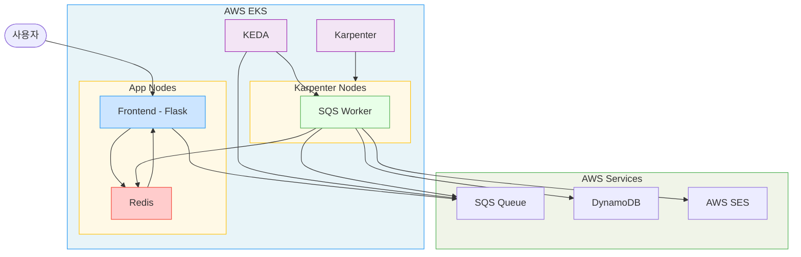
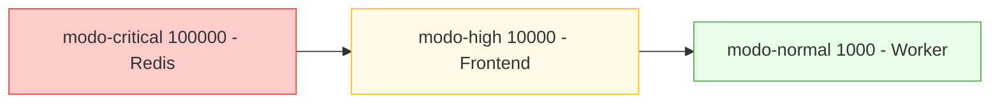
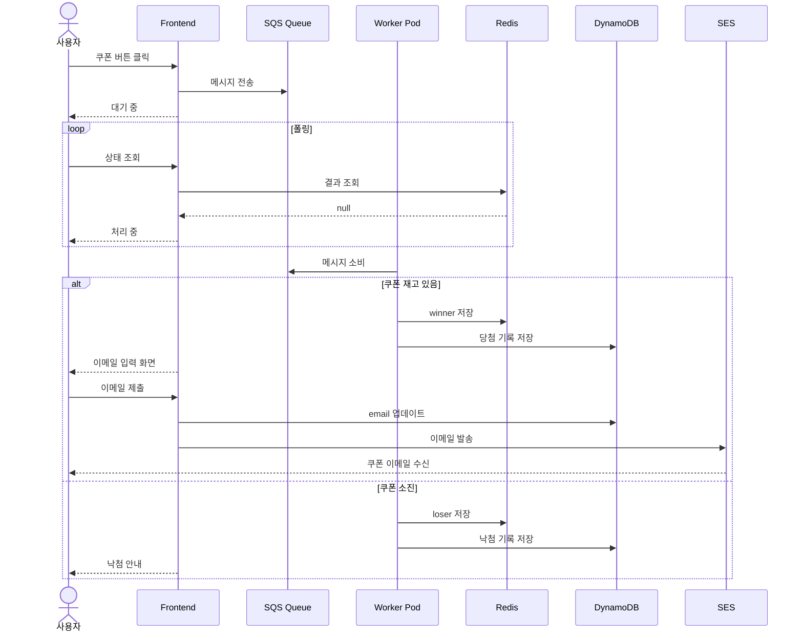

# MODO Fashion - 시스템 아키텍처

## 전체 흐름

## PriorityClass

## 쿠폰 처리 시퀀스

## DynamoDB 스키마

| 필드 | 타입 | 설명 |
|------|------|------|
| request_id | String PK | 쿠폰 클릭 시 생성되는 UUID |
| status | String | winner / loser |
| coupon_code | String | 발급된 쿠폰 코드 당첨자만 |
| claimed_at | String | 처리된 ISO 타임스탬프 |
| email | String | 당첨자 이메일 |
| email_sent | Boolean | SES 발송 완료 여부 |

## KEDA 스케일링

| 항목 | 값 |
|------|----|
| 대상 | concert-worker Deployment |
| 트리거 | SQS 메시지 수 |
| 임계값 | 5개 per replica |
| 최소 replica | 1 |
| 최대 replica | 50 |

## Karpenter 노드

| 항목 | 값 |
|------|----|
| 인스턴스 | t3.small |
| 아키텍처 | amd64 linux |
| 용량 타입 | on-demand + spot |
| 최대 CPU | 20 core |
| 노드 만료 | 72시간 |
| 통합 정책 | WhenEmptyOrUnderutilized 30초 |
